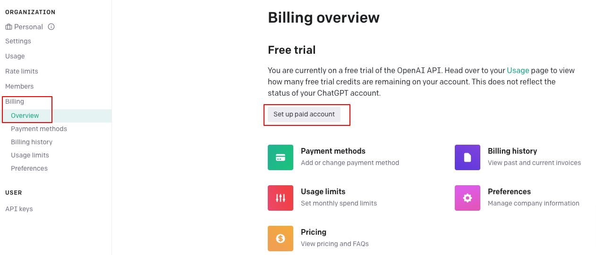

# 目次  <!-- omit in toc -->

- [1. 環境構築](#1-環境構築)
  - [1.1. 前提条件](#11-前提条件)
  - [1.2. ファイルの準備](#12-ファイルの準備)
  - [1.3. Python のインストール](#13-python-のインストール)
  - [1.4. Poetry のインストール](#14-poetry-のインストール)
  - [1.5 Chrome Web Driverのインストール](#15-chrome-web-driverのインストール)
    - [自身の使用している Chrome の Version を確かめる](#自身の使用している-chrome-の-version-を確かめる)
    - [Driverのインストール](#driverのインストール)
    - [Driverの配置](#driverの配置)
- [2. 実行準備(初回のみ)](#2-実行準備初回のみ)
- [3. 実行方法](#3-実行方法)
- [APPENDIX](#appendix)
  - [ChatGPT API TOKENの取得方法](#chatgpt-api-tokenの取得方法)

# 1. 環境構築
##  1.1. 前提条件
- PC 環境：Window 10
- 管理者アカウントでPCにログインしていること
- インターネットに接続できること

**※本システムはWebサイトの仕様がアップデートされると，改修が必要となります．**

## 1.2. ファイルの準備
1. zip をインストールします


2. zip ファイルを任意の場所に保存します


3. zip ファイルを解凍します


## 1.3. Python のインストール
※ 既に Python がインストールされている場合は，アンインストールをして以下の手順を実行するか， pyenv を使って Version を `3.10.8` に設定してください．

1. `installer` フォルダに存在する `python-3.10.8-amd64.exe` をダブルクリック

2. `Install Python 3.10.8 (64-bit)` 画面で，以下2つにチェックを入れ，`Install Now` をクリック
   - Use admin privileges when installing py.exe
   - Add python.exe to PATH

3. `ユーザーアカウント制御` 画面で `はい` をクリック
4. `Setup was successful` 画面で、`Close` をクリック


以下，確認作業
- スタートボタンをクリックし，`設定` をクリック
- `Python 3.10.8 (64-bit)` 及び `Python Launcher` が表示されていることを確認
## 1.4. Poetry のインストール
1. `installer` フォルダに存在する `install_poetry.bat` をダブルクリック
2. `WindowsによってPCが保護されました` 画面の `詳細情報` をクリック

3. `WindowsによってPCが保護されました` 画面の `実行` をクリック

4. 下記の通りバージョンが表示されたことを確認した後，コマンドプロンプト画面右上の`X` ボタンをクリックして閉じる
```
------------------------------
Poetry (version 1.3.2)
------------------------------
```

## 1.5 Chrome Web Driverのインストール
ブラウザを自動制御するために，専用のDriverをインストールする

### 自身の使用している Chrome の Version を確かめる
1. ブラウザから確かめる場合
   - 右上の点3つボタンをクリック → `help/chromeについて` をクリック
   

   - versionを確かめる(この例だと`115`となる)
   

2. コマンドから確かめる場合
- Macの場合のみ
```
/Applications/Google\ Chrome.app/Contents/MacOS/Google\ Chrome --version
```

### Driverのインストール
[こちら](https://chromedriver.chromium.org/downloads)から該当のChrome Driverをインストールする

### Driverの配置
zipを解凍し，`chromedriver.exe`を`driver`フォルダの下に移動する


# 2. 実行準備(初回のみ)
1. `data`フォルダ以下に送付した`ChatGPT_スカウト文章.xlsx`を置く
2. `config/secret.yaml`を設定する
   - `secret.example.yaml`のファイル名を`secret.yaml`に修正
   - id, password, API_TOKEN を埋める
     - id: ログインする際のid(メールアドレス)
     - password: ログインする際のパスワード
     - API_TOKEN: ChatGPTのAPI TOKEN(※取得方法はAPPENDIX)


# 3. 実行方法

1. `config/general.yaml`を設定する
以下の欄の値を必要に応じて修正する
```yaml
keyword: Excelの検索条件カラム
max_num_people: 1
```
- keyword
  - 検索をかけるワード．候補から検索する際に使用する
  - 候補にワードがないとエラーとなる
- max_num_people
  - 一回の実行で何人の人の文章を作成するかを設定する欄


2. `run.bat`をダブルクリックする


# APPENDIX
## ChatGPT API TOKENの取得方法
- 前提
  - ChatGPTの有料会員であること
- 方法
  - [公式サイト](https://auth0.openai.com/u/login/identifier?state=hKFo2SBITkdDR0tDUnI4ZmgyaS16c1dURXJVTExyQjhheF9raqFur3VuaXZlcnNhbC1sb2dpbqN0aWTZIElENThVck1BZFFwenJLVTdfRVJkZ183TlFJZVJRY2tIo2NpZNkgRFJpdnNubTJNdTQyVDNLT3BxZHR3QjNOWXZpSFl6d0Q)へLoginする
  - `Billing/Overview`を選択し，`Set up paid account`をクリック
  
  - `I'm an individual`をクリック
  
  - クレジットカード情報と住所を入れる
  - `Billing/Usage limits`を選択し，limit額を入力
  
  - 右上の`Personal`/`View API keys`を選択
  - `Create new secret key`をクリック
  - 名前をつけてKeyを発行する(※再度keyを見ることは多分できないので，人に見られないところにメモしておく)
